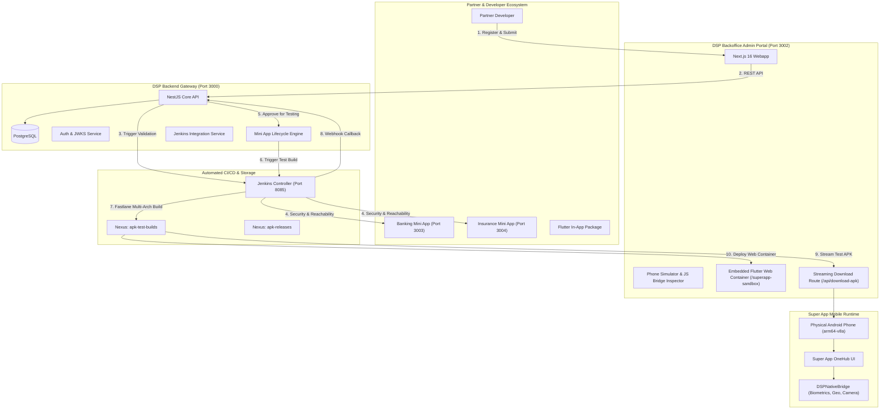

# DSP Super App Integration Platform (POC)

[](https://nestjs.com/)
[](https://nextjs.org/)
[](https://flutter.dev/)
[](https://www.jenkins.io/)
[](https://www.sonatype.com/)
[](#)

The **Digital Public Service (DSP) Super App Integration Platform** is an enterprise-grade Proof of Concept (POC) designed to govern, validate, test, assemble, and distribute third-party **Mini Apps** inside a unified national/enterprise **Super App** ecosystem.

---

## 1. System Architecture & Flow



---

## 2. Core Components

| Component | Directory | Technology | Default Port | Description |
| :--- | :--- | :--- | :--- | :--- |
| **Backend API** | [`dps_backend/`](file:///d:/Projects/fintect/dsp-poc/dps_backend) | NestJS, TypeORM, PostgreSQL | `3000` | Central API managing auth, Mini App lifecycles, Jenkins CI/CD callbacks, and issue tracking. |
| **Backoffice Portal** | [`dps_webapp_backoffice/`](file:///d:/Projects/fintect/dsp-poc/dps_webapp_backoffice) | Next.js 16 (Turbopack), Tailwind CSS | `3002` | Admin dashboard for reviewing apps, inspecting JS bridges, running Flutter Web sandbox, and downloading APKs. |
| **Super App Mobile Container** | [`dps_mobile_app/`](file:///d:/Projects/fintect/dsp-poc/dps_mobile_app) | Flutter 3.44+, Dart 3.12+, GetX | N/A (App) | Production-ready Super App featuring OneHub UI, digital wallet, featured mini app launcher, and dynamic LAN IP resolver. |
| **Core Shared Library** | [`dps_core_package/`](file:///d:/Projects/fintect/dsp-poc/dps_core_package) | Dart / Flutter | N/A (Package) | Shared contracts, base models, and native communication interfaces. |
| **Example Flutter Mini App** | [`dsp_miniapp_trust_regulator/`](file:///d:/Projects/fintect/dsp-poc/dsp_miniapp_trust_regulator) | Flutter / Dart | N/A (Module) | Sample in-app package mini app compiled directly into the Super App runtime. |
| **Banking Mini App** | [`dps_webview_webapp_banking/`](file:///d:/Projects/fintect/dsp-poc/dps_webview_webapp_banking) | Next.js, React, Tailwind CSS | `3003` | Sample WebView Mini App with live biometrics, camera, and location bridge calls. |
| **Insurance Mini App** | [`dps_webview_webapp_insurance/`](file:///d:/Projects/fintect/dsp-poc/dps_webview_webapp_insurance) | Next.js, React, Tailwind CSS | `3004` | Sample WebView Mini App for policy management and claims verification. |

---

## 3. Integration Methodologies (5 Integration Tiers)

The platform natively supports five distinct integration tiers:

1. **WebView (`WEBVIEW`)**:
   * Mini Apps run as responsive web applications served from partner infrastructure.
   * Super App injects `DSPNativeBridge` into `window` for secure bidirectional communication between web and native device layers.
   * Access to native capabilities (e.g., `getLocation`, `getBiometrics`, `openCamera`, `getDeviceInfo`, secure storage) is governed by granular permissions approved in the Backoffice.

2. **Flutter Package Artifact (`FLUTTER_PACKAGE_ARTIFACT`)**:
   * Pre-compiled and versioned Dart package artifacts hosted in a private repository (e.g., Sonatype Nexus hosted Pub repository).
   * Resolved as a pre-packaged dependency during the automated build pipeline with cryptographic checksum and artifact integrity validation.

3. **Flutter Package Source Code (`FLUTTER_PACKAGE_SOURCE`)**:
   * Direct Git repository source code integration referencing a private Git URL with specific branch, tag, or commit hash.
   * Super App CI/CD pulls source code directly into the workspace, executing automated static analysis, security auditing, and compilation into the Super App bundle.

4. **Native SDK (`NATIVE_SDK`)**:
   * Platform-specific native binary libraries (Android `.aar` / iOS `.xcframework` or Maven / CocoaPods dependencies) containing pre-compiled native modules.
   * Integrated into the Super App via Flutter platform channels (`MethodChannel` / `EventChannel`), providing maximum performance for hardware-accelerated or proprietary partner SDKs.

5. **Deep Link (`DEEP_LINK`)**:
   * OS-level URL scheme delegation (e.g., `app://open`, `banking://pay`) or Android App Links / iOS Universal Links.
   * Directly launches standalone native applications installed on the user's device, with automatic fallback redirection to the Google Play Store or Apple App Store.

---

## 4. Two-Stage Build & Delivery Lifecycle

```
[Draft / In Review] 
       │
       ▼ (Pass Automated Security Gates)
[Approved for Testing] 
       │
       ▼ (Trigger: superapp-test-build / BUILD_TYPE=debug)
[Building Stage 1] 
       │
       ▼ (Publish to Nexus: apk-test-builds)
[Testing Phase] ──► Manual Sandbox Testing (Physical Phone APK & Flutter Web Sandbox)
       │
       ▼ (Final Super App Admin & Partner Approval)
[Building Stage 2] (Trigger: superapp-test-build / BUILD_TYPE=release)
       │
       ▼ (Publish to Nexus: apk-releases)
[Active / Production] ──► Available in live public Super App Catalog
```

* **Stage 1 (Test Build)**: Assembles a debug build (`app-debug.apk`) for SA Admins and Partners to verify integrations in sandbox mode before public rollout.
* **Stage 2 (Release Build)**: Generates the official production release APK (`app-release.apk`) signed with production credentials.

---

## 5. Prerequisites & Environment Setup

* **Node.js**: `v20.x` or higher
* **Package Manager**: Strictly use **`pnpm`** (`npm install -g pnpm`)
* **Flutter SDK**: `v3.44.x` or higher (Channel `stable`) with Android toolchain
* **Docker & Docker Compose**: For PostgreSQL, Jenkins, and Sonatype Nexus
* **Android Device**: Physical Android phone (Android 10+) or Android Studio Emulator

---

## 6. Quick Start Guide

### 1. Start Infrastructure Services (Docker)
Ensure your PostgreSQL, Jenkins, and Sonatype Nexus containers are running:
* **PostgreSQL**: Port `5432` (database: `dps_db`, configured via `.env.development`)
* **Sonatype Nexus**: Port `8081` (configured via `.env.development`)
* **Jenkins Controller**: Port `8085` (configured via `.env.development`)

### 2. Start Backend API
```bash
cd dps_backend
pnpm install
pnpm run start:dev
```
*API running at `http://localhost:3000` (Swagger docs at `/api/docs`).*

### 3. Start Backoffice Web Portal
```bash
cd dps_webapp_backoffice
pnpm install
pnpm run dev
```
*Portal running at `http://localhost:3002`.*

### 4. Start Sample Mini Apps
```bash
# Terminal 1: Banking Mini App
cd dps_webview_webapp_banking
pnpm install && pnpm run dev

# Terminal 2: Insurance Mini App
cd dps_webview_webapp_insurance
pnpm install && pnpm run dev
```
*Banking available at `http://localhost:3003`, Insurance at `http://localhost:3004`.*

---

## 7. Testing & Verification

### A. Testing on Physical Android Devices

1. **Download Test APK**:
   Run the included PowerShell helper script to download the latest universal test build from Nexus:
   ```powershell
   powershell -ExecutionPolicy Bypass -File .\scripts\download-test-apk.ps1
   ```
   *(Or download directly via the Backoffice UI or `http://localhost:3002/api/download-apk?type=test&version=v1.1.0`).*

2. **Install to Device**:
   ```powershell
   adb install -r "$HOME\Downloads\superapp-test-build.apk"
   ```

3. **Multi-Architecture Support**:
   The Super App APK is built as a universal binary supporting:
   * `arm64-v8a` (Modern 64-bit Android devices: Samsung, Pixel, Xiaomi, etc.)
   * `armeabi-v7a` (32-bit legacy devices)
   * `x86_64` (PC Android emulators)

4. **Dynamic Host Resolution**:
   The Super App dynamically detects your computer's Wi-Fi LAN IP (e.g. `192.168.10.35:3000`). If your network changes, simply tap the **Gear Icon `⚙️`** on the Super App login screen to update the server address.

### B. Testing in Backoffice Interactive Sandbox

1. Navigate to any Mini App in `TESTING` status in the Backoffice.
2. Click **`[ Super App Sandbox ]`**.
3. The phone simulator will render the **live Flutter Web Super App container** (`/superapp-sandbox/index.html`) running the real OneHub UI, digital wallet, and featured mini app launcher.

---

## 8. Helper Scripts Reference

| Script | Path | Purpose |
| :--- | :--- | :--- |
| `download-test-apk.ps1` | [`scripts/download-test-apk.ps1`](file:///d:/Projects/fintect/dsp-poc/scripts/download-test-apk.ps1) | Downloads the latest test build APK from Nexus to Windows Downloads with live progress bar. |
| `download-test-apk.sh` | [`scripts/download-test-apk.sh`](file:///d:/Projects/fintect/dsp-poc/scripts/download-test-apk.sh) | Bash script to download test build APK on Linux / macOS / CI runners. |
| `Jenkinsfile.superapp-test-build` | [`scripts/jenkins/Jenkinsfile.superapp-test-build`](file:///d:/Projects/fintect/dsp-poc/scripts/jenkins/Jenkinsfile.superapp-test-build) | Jenkins pipeline compiling multi-arch APKs and Flutter Web artifacts to Nexus. |
| `Jenkinsfile.webview-validation` | [`scripts/jenkins/Jenkinsfile.webview-validation`](file:///d:/Projects/fintect/dsp-poc/scripts/jenkins/Jenkinsfile.webview-validation) | Jenkins pipeline verifying domain security and URL reachability. |

---

## 9. Developer Guidelines

* **Strict Git Policy**: Never execute `git push` without explicit instruction from the team. Keep all changes local on branch `molika`.
* **Package Manager**: Strictly use `pnpm` across all TypeScript/Node.js projects.
* **UI Design**: Strictly use clean SVG vector icons. Do not use emoji graphics in action buttons or headers.
* **State Management**: In Flutter GetX controllers, avoid `late final` declarations for route arguments to allow seamless re-entry without initialization errors.

---

_Built for the Digital Public Service Super App Ecosystem._
