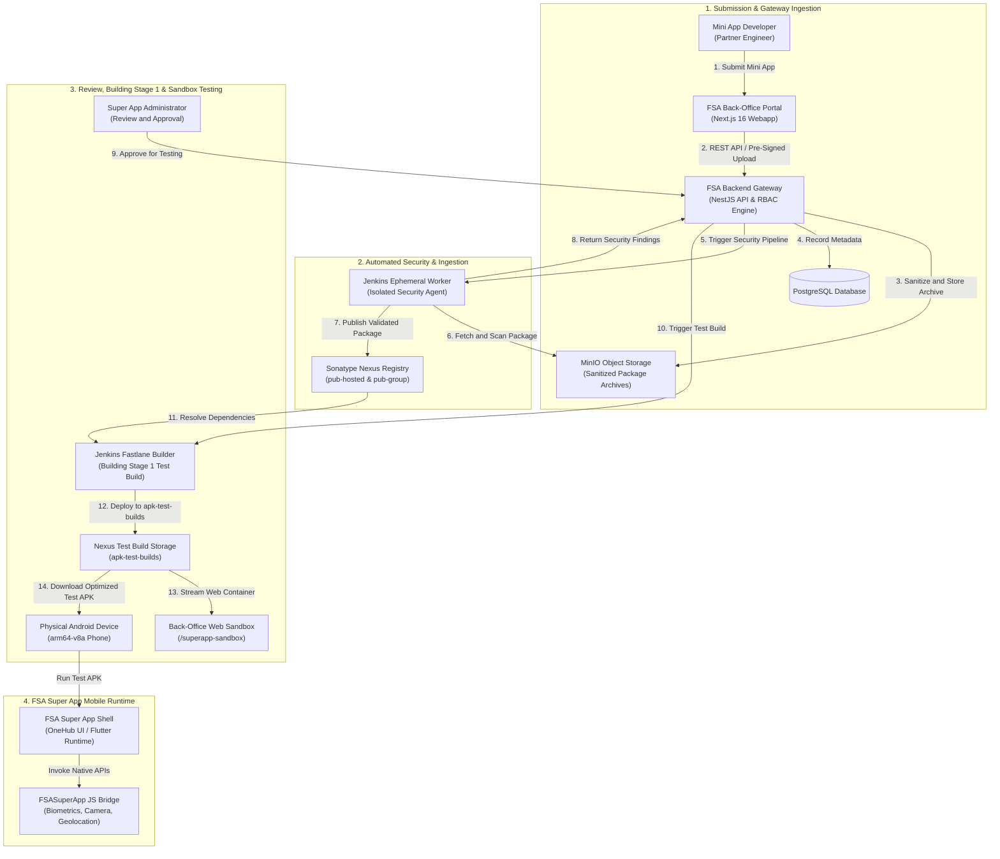
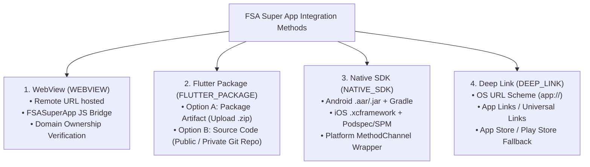
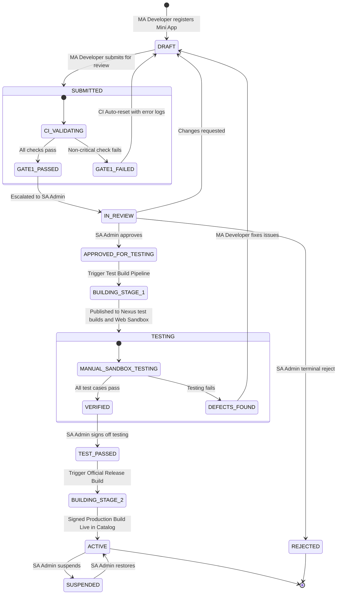
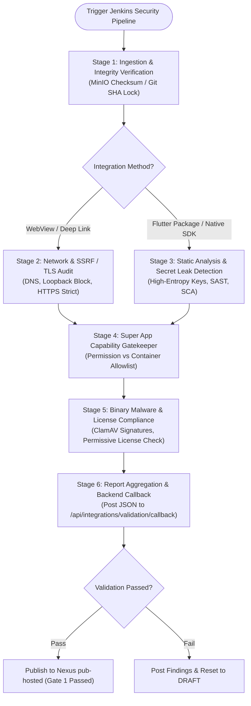
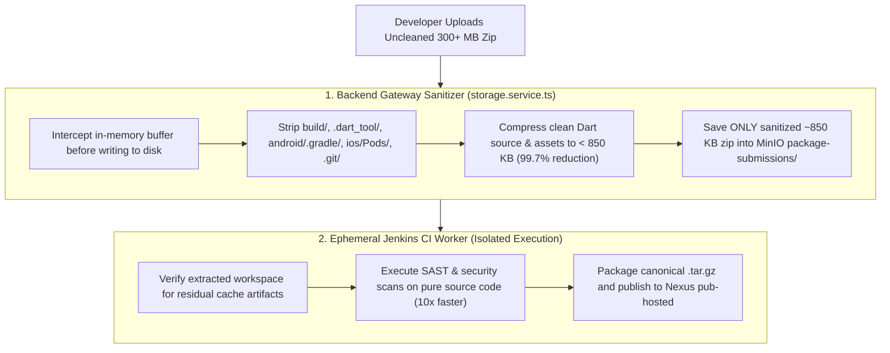
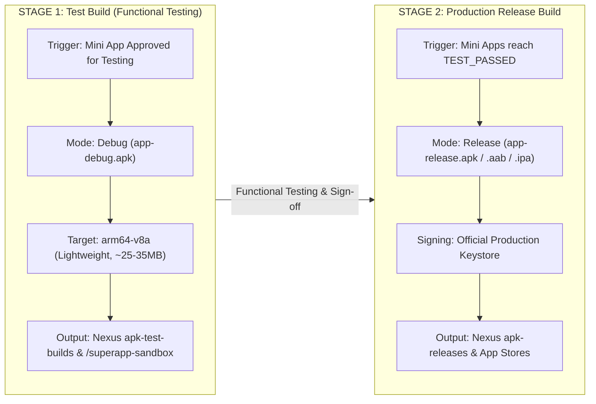

# FSA Super App Integration Platform — Unified Master Specification

> **Document Type:** Consolidated Single Source of Truth  
> **Platform Name:** FSA Super App Integration Platform  
> **Target Systems:** NestJS Backend (`superapp_backend`), Next.js 16 Back-Office (`superapp_backoffice`), Flutter Super App (`super-app`), Jenkins CI/CD, Sonatype Nexus Registry, MinIO Object Storage, Self-Hosted GitLab.

---

### Table of Contents
1. [Executive Overview & Architecture Boundaries](#1-executive-overview--architecture-boundaries)
2. [Four Supported Integration Methodologies](#2-four-supported-integration-methodologies)
3. [Normalized Lifecycle State Machine & The `TEST_PASSED` Milestone](#3-normalized-lifecycle-state-machine--the-test_passed-milestone)
4. [Real CI/CD Security Validation Pipeline & 12 Security Scanner Profiles](#4-real-cicd-security-validation-pipeline)
   * [Group A: The 8 Automated Package & Native SDK Scanners](#group-a-the-8-automated-package--native-sdk-scanners)
   * [Group B: The 4 Web & Network Security Scanners](#group-b-the-4-web--network-security-scanners)
5. [Two-Tier Quarantine & Package Size Optimization](#5-two-tier-quarantine--package-size-optimization)
6. [Two-Stage Mobile Build & Multi-Platform Architecture](#6-two-stage-mobile-build--multi-platform-architecture)
7. [Capability Catalog & Rule-Based Configuration Engine (DAG)](#7-capability-catalog--rule-based-configuration-engine-dag)
8. [Role-Based Access Control (RBAC) & Shared UI](#8-role-based-access-control-rbac--shared-ui)

---

## 1. Executive Overview & Architecture Boundaries

The **FSA Super App Integration Platform** is an enterprise-grade ecosystem designed to govern, validate, test, assemble, and distribute third-party **Mini Apps** inside a unified **FSA Super App** mobile runtime.



---

#### Primary Stakeholder Roles
* **Mini App Developer (`MA Developer`):** The partner developer / organization representative who registers, configures, submits the Mini App, sets up Git Deploy Keys or artifacts, and fixes validation findings.
* **Super App Administrator (`SA Admin`):** The internal FSA platform administrator who reviews Mini App requests, audits security results, approves permissions/change requests, triggers builds, and governs production releases.

#### Component Infrastructure
| Component | Responsibility & Current Status |
| :--- | :--- |
| **NestJS Backend** | Business logic, authentication, RBAC authorization, SSH Deploy Key generation, MinIO pre-signed URL generation, and lifecycle orchestration. **Never executes untrusted code.** |
| **MinIO Storage** | Secure durable object storage partitioned into dedicated buckets: <br/>• **`package-submissions`**: Flutter package `.zip` archives (strict private access)<br/>• **`sdk-submissions`**: Native SDK Android `.aar`/`.jar` and iOS `.xcframework.zip` bundles (strict private access)<br/>• **`mini-app-assets`**: Public UI assets (logos, icons, screenshots)<br/>*(Note: Raw security report JSONs are currently aggregated by Jenkins and stored in PostgreSQL via the backend callback API; long-term MinIO report archiving is in roadmap).* |
| **Jenkins CI/CD** | Executes validation, SAST/malware scans, capability gate checks, and Super App compilation inside **ephemeral isolated agents**. |
| **Sonatype Nexus** | The **sole trusted package & artifact registry** hosting 9 dedicated repositories: <br/>• **`pub-hosted`** (pub, hosted): Validated internal Flutter packages<br/>• **`pub-proxy`** (pub, proxy): Proxy/cache for public `pub.dev`<br/>• **`pub-group`** (pub, group): Virtual endpoint consumed by Super App (`pub-hosted` + `pub-proxy`)<br/>• **`maven-sdk-hosted`** (maven2, hosted): Validated Android `.aar`/`.jar` SDK packages<br/>• **`cocoapods-specs`** (raw, hosted): iOS CocoaPods private podspecs<br/>• **`raw-sdk-artifacts`** (raw, hosted): Raw binary SDK archives & `.xcframework.zip`<br/>• **`apk-test-builds`** (raw, hosted): Stage 1 test build APKs (`app-debug.apk`)<br/>• **`apk-releases`** (raw, hosted): Stage 2 official production signed APKs/AABs<br/>• **`superapp-artifacts`** (raw, hosted): Super App core releases & Flutter Web Sandbox bundles |
| **Git Providers** | Source repository hosting. GitHub is used for development/testing; **official enterprise production code is hosted on the organization's self-hosted GitLab**. The `GitProvider` service abstraction enables environment swapping via configuration. |
| **Next.js 16 Back-Office** | Unified admin UI presenting role-tailored workflows (MA Developer vs SA Admin) using shared components. |
| **Flutter Super App Shell** | Production mobile client dynamically integrating approved mini app packages or webview containers. |

---

## 2. Four Supported Integration Methodologies

The platform supports **4 primary integration methods** (with the Flutter Package method providing 2 flexible ingestion options):



### Method 1: WebView (`WEBVIEW`)
* **Runtime:** Responsive web app hosted on partner infrastructure.
* **JS Bridge Interface:** Super App injects **`window.FSASuperApp`** (or `@fsasuperapp/sdk`) into the webview window for biometric authentication, location, camera, and device telemetry.
* **Security & Verification:** Automated domain ownership check via `.well-known` challenge, SSRF protection against internal loopback/RFC1918 IPs, DNS rebinding mitigation, and HTTPS/TLS strict enforcement.

### Method 2: Flutter Package (`FLUTTER_PACKAGE`)
Supports two ingestion options:

#### Option A: Package Artifact (`ARTIFACT`)
1. Developer uploads a `.zip` archive via the Back-Office.
2. Backend gateway sanitizes the buffer and stores it in the **`package-submissions`** bucket in MinIO with strict private access.
3. Jenkins runs security and contract scans in an isolated agent.
4. Upon passing scans and SA Admin approval, Jenkins publishes the canonical `.tar.gz` to Sonatype Nexus (`pub-hosted`).
5. Super App consumes the approved version from Nexus virtual group (`pub-group`):
   ```yaml
   dependencies:
     banking_miniapp:
       hosted: http://nexus.internal:8081/repository/pub-group
       version: ^1.2.0
   ```

#### Option B: Source Code (`SOURCE_CODE`)
* **Public Repository:** Developer provides Git Clone URL, Tag/Branch, and Version.
* **Private Repository:** Developer provides Git Clone URL, Tag/Branch, Version, and utilizes a **Deploy Key**:
  1. FSA Super App Backend generates a dedicated SSH Keypair for the integration.
  2. The Developer copies the public key and adds it as a **Deploy Key (Read-Only)** in their GitLab or GitHub repository.
  3. CI pipeline clones the repository using the private key and locks the integration to the exact immutable **Git Commit SHA**.

### Method 3: Native SDK (`NATIVE_SDK`)
* **Bundle Structure:** Platform binaries (Android `.aar`/`.jar`, ProGuard/R8 rules; iOS `.xcframework.zip`, `.podspec`, `PrivacyInfo.xcprivacy`).
* **Packaging & Storage:** Developer uploads Native SDK `.aar` or `.xcframework.zip` bundle into the **`sdk-submissions`** bucket in MinIO with strict private access.
* **Verification & Nexus Publish:** Jenkins validates headers, binary symbols, malware, and dependencies inside an isolated agent; approved SDKs are published to Nexus and bound to the Super App via Flutter `MethodChannel` / `EventChannel`.

### Method 4: Deep Link (`DEEP_LINK`)
* **Runtime:** OS-level URL scheme delegation (`banking://pay`) or Android App Links / iOS Universal Links to launch standalone installed partner apps with store fallback redirection.

---

## 3. Normalized Lifecycle State Machine & The `TEST_PASSED` Milestone

To guarantee that only verified, tested mini apps are assembled into the official production Super App release, the lifecycle incorporates a dedicated **`TEST_PASSED`** state:



### Purpose of Key States
* **`TESTING`:** Mini App is currently undergoing active testing in the Stage 1 Test Build (physical Android APK & interactive Web Sandbox).
* **`TEST_PASSED`:** Testing has concluded successfully with full SA Admin sign-off. When the **Building Stage 2 (Production Release)** pipeline runs, it queries the database to assemble **only mini apps with `TEST_PASSED` status**.
* **`ACTIVE`:** Mini App is officially packaged, signed, and live in the released production Super App binary.
* **Human-Gated Rejection Rule:** Automated CI failures only route status back to `DRAFT` for developer fixes. A terminal `REJECTED` or `SUSPENDED` status requires an explicit, audited decision by an **SA Admin**.

---

## 4. Real CI/CD Security Validation Pipeline

The platform uses modular Jenkins pipelines (`Jenkinsfile.miniapp-validation` and specialized job definitions) executing inside isolated ephemeral workers:



### Security Gates in Real Code
1. **Stage 1 (Ingestion & Integrity):** Ingests submission from MinIO or locks Git repo to exact commit SHA; computes SHA-256 integrity hash.
2. **Stage 2 (Network & Web Security):** Enforces SSRF defense (blocking `localhost`, `127.0.0.1`, `192.168.x`, `10.x`), verifies HTTPS TLS configuration and allowed navigation domains.
3. **Stage 3 (Static Code & Secret Scans):** Scans for high-entropy API keys, private keys, database credentials, and deprecated packages.
4. **Stage 4 (Capability Gatekeeper):** Validates requested native permissions against the Super App container allowlist.
5. **Stage 5 (Malware & License Compliance):** Executes ClamAV binary signature analysis and ensures open-source license compliance.
6. **Stage 6 (Backend Callback):** Aggregates all JSON reports into a single normalized payload, calculates a Security Score (0–100), and posts results to NestJS backend for real-time display in the Back-Office.

### Security Scanner Profiles: 8 Package Scanners + 4 Web Scanners (12 Total)

The platform provides **12 specialized security engines** partitioned into two dedicated profiles tailored to the integration runtime:

#### Group A: The 8 Automated Package & Native SDK Scanners
Executed automatically by Jenkins on every **Flutter Package** (`FLUTTER_PACKAGE`) and **Native SDK** (`NATIVE_SDK`) submission:

| # | Scanner Name | Engine ID | Core Technology | Scope & Purpose |
| :---: | :--- | :--- | :--- | :--- |
| **01** | **Cryptographic SHA-256 Digest** | `ingest` | SHA-256 Digest / Git Commit SHA Locker | Unpacks package source and verifies cryptographic checksum and manifest integrity. |
| **02** | **Secret & API Key Leak Detection** | `secret_scan` | `Gitleaks` / `TruffleHog` | Scans source code and configs for leaked private keys, JWT secrets, and hardcoded API tokens. |
| **03** | **Static Analysis (SAST)** | `sast` | `Semgrep` / `SonarQube` / AST Guard | Analyzes source code for security flaws, unsafe memory operations, and forbidden platform APIs. |
| **04** | **Dependency Vulnerability Scan (SCA)** | `dependency_scan` | `Trivy` / `OSV Audit` (CVE Database) | Audits direct and transitive dependencies against known CVE security vulnerability databases. |
| **05** | **Super App Capability Gatekeeper** | `capability_gate` | Super App Container Policy Engine | Enforces container boundary, verifying declared host capabilities against platform allowlists. |
| **06** | **Software Bill of Materials (SBOM)** | `sbom` | `Syft` / CycloneDX 1.5 & SPDX | Generates cryptographic CycloneDX & SPDX manifests tracking all packages and sub-dependencies. |
| **07** | **Open Source License Compliance** | `license_compliance` | `FOSSA` / License-Checker | Audits dependency licenses to prevent copyleft contamination and legal IP infringements. |
| **08** | **Malware & Binary Signature Scan** | `malware_scan` | `ClamAV` / `YARA` Rules Engine | Deep signature inspection of compiled platform binaries (`.aar`, `.xcframework`) for malware payloads. |

#### Group B: The 4 Web & Network Security Scanners
Executed automatically by Jenkins on every **WebView** (`WEBVIEW`) and **Deep Link** (`DEEP_LINK`) submission:

| # | Scanner Name | Engine ID | Core Technology | Scope & Purpose |
| :---: | :--- | :--- | :--- | :--- |
| **09** | **Pre-Flight & SSRF Defense** | `ssrf` | DNS & Private Loopback / IP Filter | Resolves DNS and blocks internal loopback / RFC1918 private IPs (`localhost`, `10.x`, `192.168.x`). |
| **10** | **Domain TLS/SSL Transport Security** | `domain_tls_audit` | `testssl.sh` / SSL Labs Analyzer | Audits TLS 1.2/1.3 cipher suites, HTTPS certificates, HSTS headers, and transport encryption. |
| **11** | **Security Headers & CSP Audit** | `csp_headers_audit` | Content-Security-Policy & CORS Validator | Verifies Content-Security-Policy (CSP), X-Frame-Options, CORS origins, and cookie security flags. |
| **12** | **Dynamic Security Probing (DAST)** | `dast_zap` | OWASP ZAP DAST Scanner | Dynamic probing of web endpoints for cross-site scripting (XSS), CSRF, and unprotected APIs. |

---

## 5. Two-Tier Quarantine & Package Size Optimization

### Why Local Packages Are 300+ MB vs Cleaned < 850 KB
Development builds leave heavy intermediate compilation artifacts: `build/` (150–500MB), `.dart_tool/` (40–120MB), `android/.gradle/` (50–150MB), `ios/Pods/` (50–200MB), and `.git/` (10–100MB).

### Two-Tier Zero-Waste Defense Architecture



---

## 6. Two-Stage Mobile Build & Multi-Platform Architecture



### Architecture Optimization & Cross-Platform Support

#### 1. Stage 1 Test Build Optimization (`arm64-v8a`)
* **Optimization Decision:** For Stage 1 test APKs, compiling strictly for **`arm64-v8a`** reduces test APK size from ~85MB+ down to **~25–35MB (over 55% smaller)** and speeds up CI build time by 3x.
* **Device Coverage:** Over 98% of modern physical test devices (Samsung, Google Pixel, Xiaomi, Oppo, Vivo) and modern Huawei devices (HarmonyOS / EMUI based on 64-bit ARM) run `arm64-v8a`.
* **PC Emulators:** Dedicated `x86_64` debug builds can be triggered on-demand when emulator testing is explicitly required.

#### 2. Stage 2 Multi-OS Production Distribution
* **Android (Google Play / Direct Distribution):** Generates **Android App Bundle (`.aab`)** via `flutter build appbundle`. Google Play dynamically serves split APKs per device architecture (`arm64-v8a`, `armeabi-v7a`), minimizing download size to ~15–20MB for end-users.
* **Huawei (AppGallery):** AppGallery supports split APKs and AABs targeting `arm64-v8a` and `armeabi-v7a`.
* **iOS (Apple App Store / TestFlight):** Compiled via Fastlane/Xcode (`flutter build ipa`) for iOS 64-bit devices.
* **Flutter Web Container:** Embedded web sandbox deployed at `/superapp-sandbox` for instant browser-based simulation in the Back-Office without installing mobile binaries.

---

## 7. Capability Catalog, Permission Detection & Native SDK Codegen

### 1. Capability Catalog & Permission Management
Platform capabilities and hardware permissions are centrally registered in the PostgreSQL `permission_definitions` table and managed via `PermissionsService`:
* **`camera` (Category: `DEVICE`):** Access device camera to capture images, photos, or scan QR codes.
* **`location` (Category: `DEVICE`):** Access device GPS/geolocation coordinates for mapping and location-based services.
* **`biometrics` (Category: `SECURITY`):** Access biometric hardware (Face ID, Touch ID, Android BiometricPrompt) for secure authentication.
* **`microphone` (Category: `DEVICE`):** Access device microphone for audio recording and voice features.
* **`storage` (Category: `DEVICE`):** Read and write to device local filesystem and sandboxed app storage.

#### Automated Permission Detection
During CI/CD Stage 4 validation, `PermissionDetectorHelper` statically analyzes submitted package source code and bundle assets to verify that declared capabilities in the manifest match actual code usage of `@fsasuperapp/sdk` and native APIs.

---

### 2. Native SDK Marker-Based Code Generation Engine
For `NATIVE_SDK` integrations, the platform does not require manual shell scripts; instead, `renderers.ts` and `GitLabMrService` automatically parse approved vendor metadata and inject target language bindings into the Mobile Super App repository using marked region comments (`// === GENERATED NATIVE SDK ... ===`):

* **iOS Podfile (`ios/Podfile`):** Injects vendor pod declarations referencing Nexus CocoaPods specs:
  ```ruby
  # === GENERATED NATIVE SDK PODS — DO NOT EDIT ===
  pod 'KYCModule', :podspec => 'http://nexus.fsa.local:8081/repository/cocoapods-specs/Specs/KYCModule/1.2.0/KYCModule.podspec'
  # === END GENERATED NATIVE SDK PODS ===
  ```
* **Android Gradle (`android/app/build.gradle.kts`):** Injects Maven repository coordinates and implementation dependencies:
  ```kotlin
  repositories {
      // === GENERATED NATIVE SDK SOURCES — DO NOT EDIT ===
      maven { url = uri("http://nexus.fsa.local:8081/repository/maven-sdk-hosted/") }
      // === END GENERATED NATIVE SDK SOURCES ===
  }
  dependencies {
      // === GENERATED NATIVE SDK DEPS — DO NOT EDIT ===
      implementation("com.fsa.sdk:kyc-module:1.2.0")
      // === END GENERATED NATIVE SDK DEPS ===
  }
  ```
* **iOS Method Channel Bridge (`ios/Runner/AppDelegate.swift`):** Injects module imports and registers the Flutter method channel `com.example.dsp_mobile/<appId>` with standard lifecycle hooks (`initialize(userId:jwtToken:)` and `present(from:completion)`).
* **Android Method Channel Bridge (`MainActivity.kt`):** Injects Kotlin imports and registers the corresponding `MethodChannel` dispatchers.

---

### 3. Permission Proposal & Change Request Workflows

#### A. Permission Proposal Workflow (`PermissionProposal` Entity)
When a Mini App Developer requires an uncatalogued hardware or system permission:
1. **Creation:** The developer submits a proposal containing the `permissionKey`, `justification`, and technical requirements.
2. **Review:** SA Admins inspect the proposal via `/permission-proposals` and execute `/permission-proposals/:id/review`.
3. **Status Transitions:** Proposals are assigned `APPROVED`, `IN_DEVELOPMENT` (targeted to a future Super App release version), or `REJECTED`.
4. **Notification:** The backend triggers real-time notification dispatch to the requesting developer upon decision.

#### B. Sensitive Change Request Workflow (`pendingRevision`)
To ensure zero production downtime and prevent unauthorized runtime mutations:
1. When an already-approved or published Mini App modifies sensitive parameters (e.g., WebView URLs, Native SDK coordinates, or requested capabilities), the live version remains active.
2. Changes are captured in a structured `pendingRevision` draft payload.
3. SA Admins inspect visual side-by-side field diffs via `<RevisionReviewModal />` in the Back-Office and either **Approve & Merge** or **Reject / Request Changes** with mandatory audit justifications.

---

## 8. Role-Based Access Control (RBAC) & Shared UI

### 1. RBAC Roles & Permissions Matrix
The platform defines four primary system roles in `access-control/seeder.service.ts` and `lib/auth.tsx`:

| Granular Action / Permission | `SUPER_ADMIN` | `ADMIN` (SA Admin) | `MINI_APP_MANAGER` (MA Developer) | `DEVELOPER` |
| :--- | :---: | :---: | :---: | :---: |
| `miniapp:create` | ✅ | ✅ | ✅ | ❌ |
| `miniapp:read` | ✅ | ✅ | ✅ | ✅ |
| `miniapp:update` | ✅ | ✅ | ✅ (Own App) | ❌ |
| `miniapp:submit` | ✅ | ✅ | ✅ (Own App) | ❌ |
| `miniapp:delete` | ✅ | ✅ | ❌ | ❌ |
| `miniapp:approve` / `reject` / `suspend` | ✅ | ✅ | ❌ | ❌ |
| `miniapp_permission:approve` | ✅ | ✅ | ❌ | ❌ |
| `permission_proposal:read` | ✅ | ✅ | ✅ (Own Proposals) | ❌ |
| `permission_proposal:review` / `approve` | ✅ | ✅ | ❌ | ❌ |
| `issue:resolve` | ✅ | ✅ | ❌ | ❌ |
| `super_app:read` | ✅ | ✅ | ❌ | ✅ |
| `super_app:manage` | ✅ | ❌ | ❌ | ❌ |
| `user:read` / `user:manage` | ✅ | `user:read` only | ❌ | ❌ |
| `role:read` / `role:manage` | ✅ | ❌ | ❌ | ❌ |
| `permission:read` / `permission:manage` | ✅ | `permission:read` only | `permission:read` only | `permission:read` only |
| `organization:read` / `manage` | ✅ | `organization:read` only | `organization:read` only | ❌ |
| `audit_log:read` | ✅ | ❌ | ❌ | ❌ |
| `settings:manage` | ✅ | ❌ | ❌ | ❌ |

---

### 2. Next.js 16 Back-Office Component Architecture
The Back-Office (`superapp_backoffice/src/app/miniapps/[id]/page.tsx` & `MiniAppDetailTabs.tsx`) utilizes modular form and reporting components driven by the user's active RBAC role:

* **`<BasicInfoForm />` (General Information Tab):** General metadata, display name, category, icon/logo assets, terms of service, and privacy policy URLs.
* **`<TeamForm />` (Team & Support Tab):** Organization affiliation, team name, owner contact, support email, and Telegram alert group.
* **`<IntegrationForm />` (Technical Integration Tab):** Method-specific configuration (`WEBVIEW`, `FLUTTER_PACKAGE`, `NATIVE_SDK`, `DEEP_LINK`) with dynamic validation for URLs, Git repositories, deploy keys, or Nexus Maven/CocoaPods coordinates.
* **`<PermissionsForm />` & `<UnsupportedPermissionsModal />` (Permissions & Capabilities Tab):** Capability selection against the catalog, purpose description compliance checks, and uncatalogued permission proposal submission.
* **`<ValidationReportTab />` (Security & Compliance Report Tab):** Real-time 6-stage CI/CD visualizer, live log streaming, and aggregated security findings across Group A (Package) and Group B (Web) scanners.
* **`<ActivityTab />` (Activity & Audit Log Tab):** Human-readable lifecycle history timeline tracking submission events, scan completions, and review notes.
* **`<VersionHistoryTab />` (Versions & Releases Tab):** Archive of historical and active versions, staging test builds, release changelogs, and APK download links.
* **`<MiniAppDetailHeader />` & `<MiniAppLifecycleBanners />`:** Top-level lifecycle status chips (`DRAFT`, `SUBMITTED`, `IN_REVIEW`, `APPROVED`, `PUBLISHED`, `SUSPENDED`) and contextual review/submission action bars.
* **`<RevisionReviewModal />`:** Side-by-side JSON/field diff modal enabling SA Admins to evaluate and approve pending change revisions.

